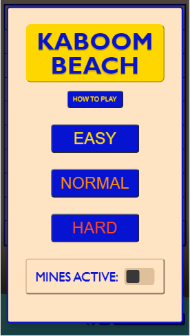
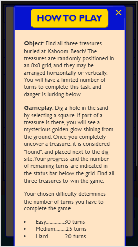
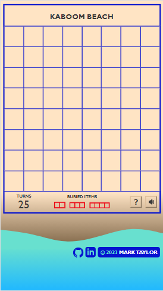
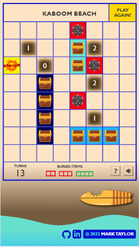

# Kaboom Beach
Kaboom Beach is a puzzle game that combines elements of <i>Battleship</i> and <i>Minesweeper</i>, creating a unique gameplay experience where both logic and luck are needed for success. A distinctive beach theme and various sound effects enhance the user experience, and the short gameplay loop of less than a minute encourages replayability. This project was developed as part of my training in the first module of the Get Coding program. 

<b>---Please play with sound ON for the best experience, but check your volume first---</b>

Play it here--> https://marktaylor7.github.io/KaboomBeach/

# Motivation
As a new student with Get Coding, I wanted to challenge myself with a project that would require me to work in-depth with Javascript, and test my problem-solving abilities. Setting up the logic for this game pushed me to gain a deeper understanding of the programming language, and required extensive use of functions, arrays, "if" statements, nesting, loops, and DOM manipulation. I also have an interest in UI/UX, and wanted to create an engaging user experience that would encourage me to dive into CSS.

Finally, video games have been a hobby of mine since I was very young, so I had a strong personal interest in creating my own game from scratch. I believe my experiences with playing games, and thinking about their design and structure, influenced many of my choices when developing this project.

# Features
<li>Two game modes - the default setting is a relaxed experience where the user seeks hidden "treasures" in a grid (think <i>Battleship</i> with no opponent). Adding mines to the playing area introduces an element of peril, where the user can lose at any moment. Logical thinking and luck are required to "survive" </li>
<li>Three difficulty settings</li>
<li>Treasure locations are completely randomized each time, ensuring no two gameplay runs are the same</li>
<li>Various sound effects and animations enhance the user experience</li>

# Technologies used
<li>HTML</li>
<li>CSS</li>
<li>Javascript</li>
<li>Various image and sound editors, including Inkscape, PhotoPad, and Audacity</li>

# Credits
My coach, Leon Chisholm, has been a source of guidance, knowledge, and encouragement throughout the entire development timeline. I can't thank him enough for his support. Matthew Kennedy was a wealth of knowledge as UI/UX coach, and his feedback was very useful in optimizing the game's look and feel. 

